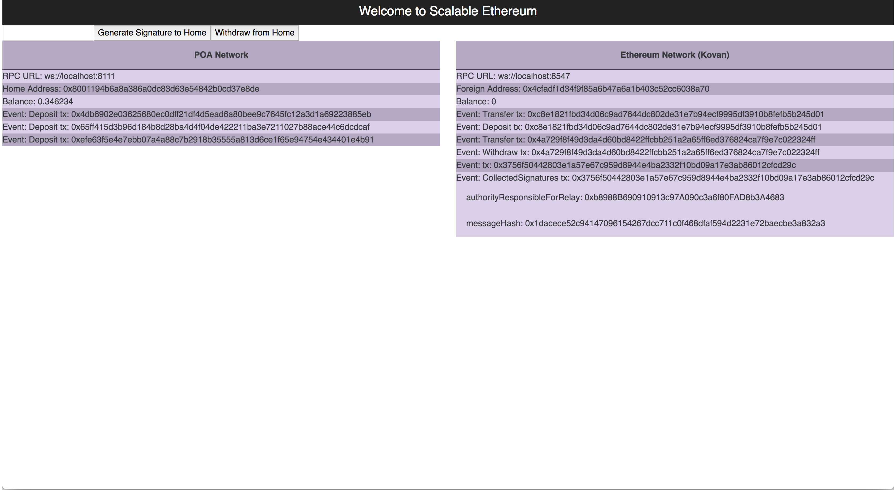

# Bridge UI app to show cross chain transactions

This UI app provides an ability for a user to watch for events that is 
happening on both sides of the bridge.

On the left side is HomeBridge contract
On the right side is ForeignBridge contract
If you want to use this app, please follow the instruction:

1. Deploy HomeBridge contract
2. Deploy ForeignBridge contract
3. Provide addresses into `.env` file
4. Specify websockets endpoints for both sides of nodes
5. Send native coin to HomeBridge smart contract
6. Make sure you received ERC20 on ForeignBridge
7. When you want to exchange ERC20 from ForeignBridge Click
"Generate Signature to Home" button on the ForeignBridge chain network
8. Make sure you have CollectedSignatures event with message hash
9. Provide the message hash into the input box and click
"Withdraw from Home" in order to get locked coins from HomeBridge to your address

# .env file
```
REACT_APP_HOME_BRIDGE_ADDRESS=0x8001194b6a8a386a0dc83d63e54842b0cd37e8de
REACT_APP_FOREIGN_BRIDGE_ADDRESS=0x4cfadf1d34f9f85a6b47a6a1b403c52cc6038a70
REACT_APP_FOREGIGN_WEB_SOCKETS_PARITY_URL=ws://localhost:8547
REACT_APP_HOME_WEB_SOCKETS_PARITY_URL=ws://localhost:8111
```

# Running the app
```bash
npm install
npm start
```

# To Deploy
```bash
npm run build
```
then you should have `./build` folder where you can deploy it anywhere
Example:
```bash
cd ./build
python -m http.server 8002
```

